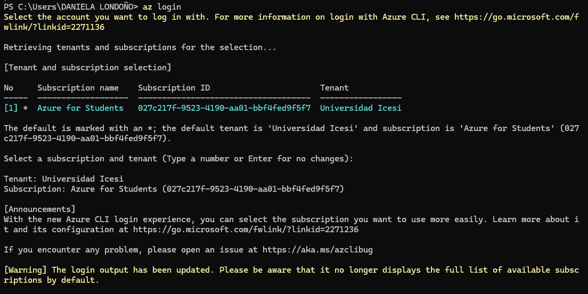
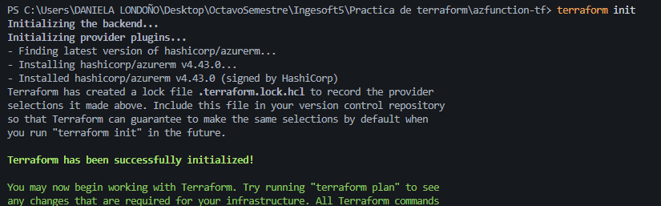
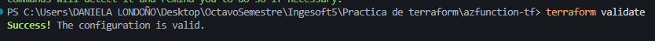
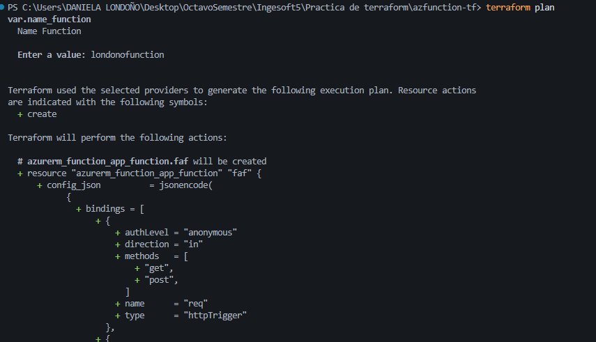
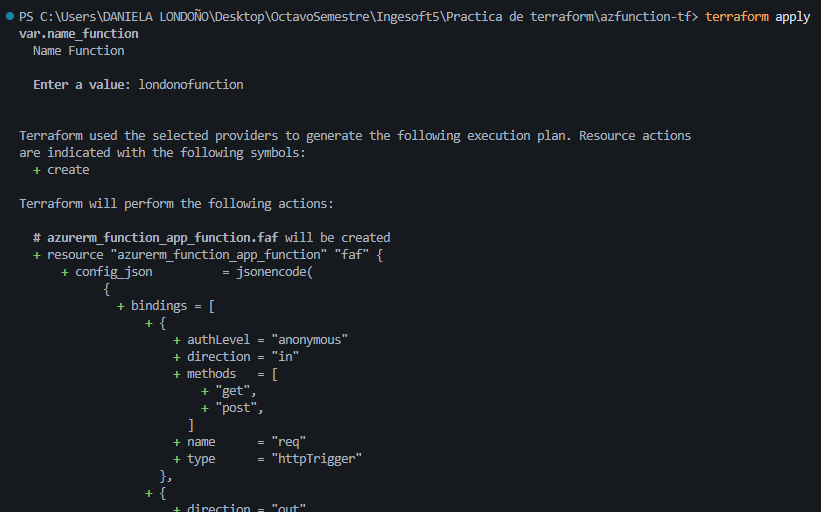
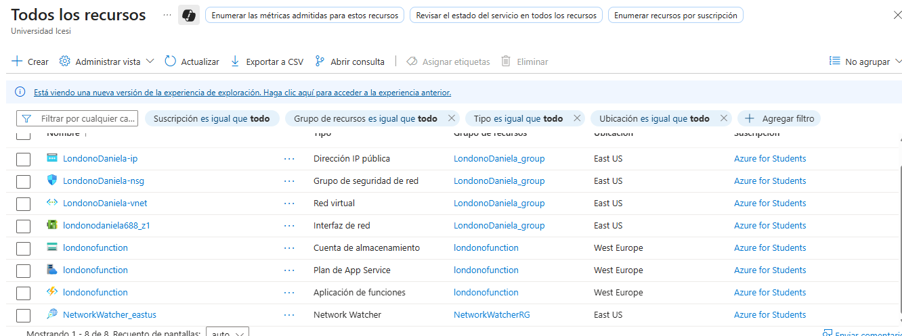

# Despliegue con Terraform

Leidy Daniela Londoño Candelo
---
Este documento describe el proceso de instalación, configuración y despliegue de una **Function App en Azure** usando **Terraform**.

---

## 1. Inicio de sesión con azure
Se inició sesión con la cuenta institucional de la universidad, con el comando:

```powershell
az login
````

y verficamos la sucripción activa




## 2. Inicialización de Terraform

Dentro del directorio del proyecto se ejecutó:

```powershell
terraform init
```

que descarga el proveedor `azurerm` y crea el archivo `.terraform.lock.hcl`.



## 3. Validación de la configuración

Se validó que el archivo .tf sea correcto, con:

```powershell
terraform validate
```



## 4. Modificación en la definición del provider

Inicialmente, el bloque del provider estaba definido así:

```hcl
provider "azurerm" {
  features {}
}
```

Posteriormente, se añadió la propiedad `subscription_id` para asegurar que la infraestructura se desplegara en la suscripción correspondiente de Azure:

```hcl
provider "azurerm" {
  features {}
  subscription_id = "027c217f-9523-4190-aa01-bbf4fed9f5f7"
}
```

## 5. Ejecución del plan

Se generó el plan de ejecución con:

```powershell
terraform plan
```

Este lista los recuros a crear:

- Grupo de recursos (azurerm_resource_group)

- Plan de servicio (azurerm_service_plan)

- Cuenta de almacenamiento (azurerm_storage_account)

- Function App (azurerm_windows_function_app)

- Función (azurerm_function_app_function)



## 6. Aplicación del plan

Finalmente, se aplicó el plan con:

```powershell
terraform apply
```

creando todos los recursos en Azure



Posteriormente, se verificó la creación de los recursos en el portal de Azure.


